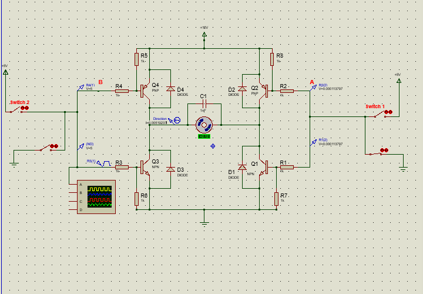

# H-Bridge Motor Driver Circuit

This project implements an H-Bridge motor driver for controlling the direction and speed of a DC motor using PWM signals.

## 🔧 Features
- Directional motor control (Forward/Reverse)
- Speed control using PWM
- Built with transistors and diodes for safe switching
- Simulated using Proteus and tested on hardware

## 📁 Contents
- `HBridge_Schematic.png` – circuit diagram
- `HBridge.dsn` – Proteus simulation file

## 🧠 Skills Gained
- Power electronics
- PWM and motor control
- H-Bridge design and simulation
- Practical hardware implementation

## 📸 Preview

## 👨‍🔧 Author
Ahmed Hassan  
[LinkedIn](https://www.linkedin.com/in/ahmed-h-abdelhalim-87a016321)
